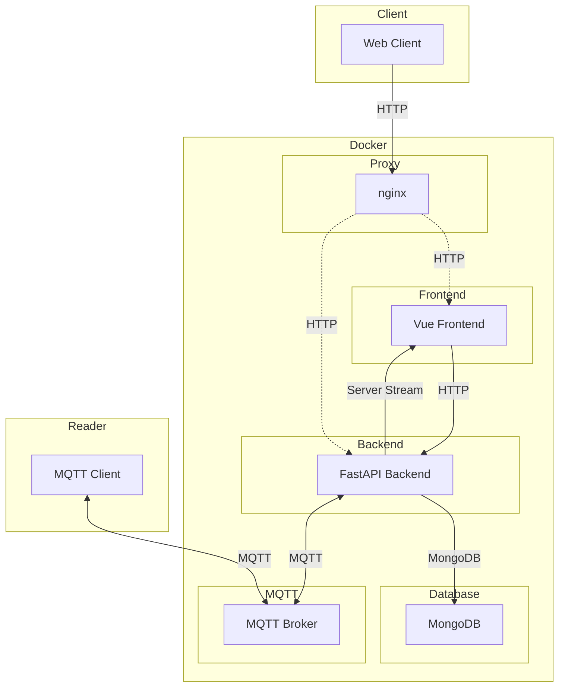
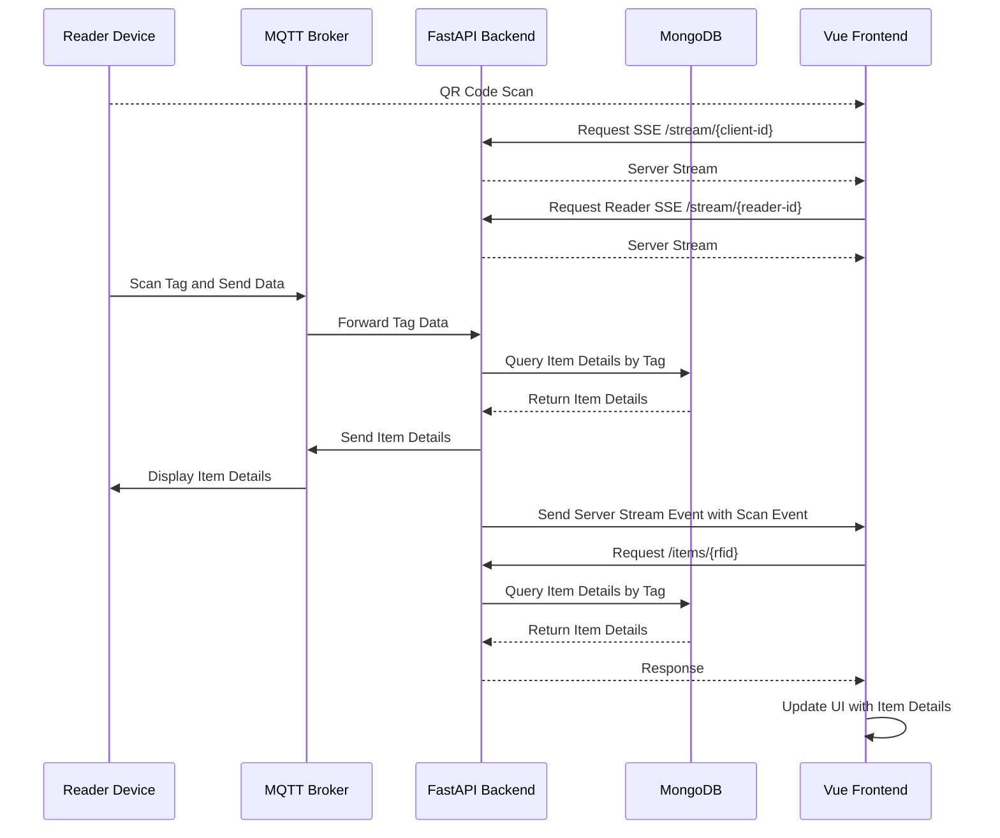

# Where Is My Stuff

You might know your stuff, but do you know mine?

_Where Is My Stuff_ is a makerspace inventory tool designed for use by people who may not know what is available or where it is located.

## Setup
The provided `docker-compose.yml` includes all necessary startup configurations. Adapt it to your liking.

1. Start with `docker compose up`.
2. Visit [localhost:8080]() 

### Adapting Service Configuration

There are several ways to configure the application. These are, ordered:

1. Default configuration, *which should be left as is and is overwritten by*
2. `config.yml`,  *which is overwritten by*
   
   + To make changes to the `config.yml`:

      1. Copy the backend configuration: `cp docker/config.dist.yml docker/config.yml`.
      2. Make changes to `config.yml`.
      3. Use `config.yml` in the backend service mount. 
3. Environment variables (ie. given in docker-compose.yml). These are dot-notated strings of their corresponding yml-paths, i.e.:
    ```yml
    server:
      host:
        port: 8080
    ```
    is overwritten by the env variable `server.host.port=1234`   


Visit the frontend and check the backend connection (default: [localhost:8080]).

## Development

To start developing, use the provided devcontainer. To start it, follow [the vscode documentation on dev containers](https://code.visualstudio.com/docs/devcontainers/containers).

Configure the backend service in `backend/src/config.yml`. Note the linked `config.dist.yml` file in the `/docker` folder.

Then start the backend and frontend services using the provided profiles in `.vscode/launch.json`:
+ `backend` and `frontend` for a native environment, or
+ `build-services` for full docker setup 

### Running Tests

To run full integration tests of all services together using playwright, you have multiple options:

1. Manual Native Services (Recommended atm):  
   + run `cd integration && npx playwright install --with-deps`
   + run the "backend" "frontend" and "integration-tests" launch command
1. Native (might be useful for debugging or bugged docker setups) (**WIP**):
   + run the "integration-tests" launch command *or*
   ```sh {interactive=true}
   docker compose -f docker-compose.yml -f integration/docker-compose.tests.yml up --build --force-recreate
   cd integration && npx playwright install --with-deps && npx playwright test`
    ```
    + *Note: currently, a playwright container is started with it, which is failing. Ignore or fix it* 
1. Container (**WIP**): 
   + the playwright container image executes all tests and prints out results.
    ```sh {interactive=true}
    docker compose -f docker-compose.yml -f integration/docker-compose.tests.yml up --abort-on-container-exit --exit-code-from playwright --build
    docker compose -f docker-compose.yml -f integration/docker-compose.tests.yml logs playwright
    ```
1. CI/CD (**WIP**): 
   + on push, tests are run automatically inside the playwright container
1. Native Services (**WIP**)
   + Add `integration/start-services.sh` as to the playwright config. Then run option 1.

When using the docker compose setup (all first three options), the volume of the database is reset each time the db container is restarted.

## Architecture



## Sequence Diagram


And there is a proxy somewhere.

## Use Cases:

* Storing items
* Finding items
* Analysis

### Administrative:

* Bulk item storage:

    Using LLMs (e.g., ChatGPT) to pre-fill fields:

    * Item:
        - Name, ID, Storage Location, Tags/Category
        - Container TAG ID: uuid
        - Short Name: str
        - Description
        - Amount
        - Category/Tags
        - Image[]
        - Storage Location
        - Storage Location Tag ID
        - Current Location
        - Borrowed by
        - Cost per Item
        - Manufacturer
        - Model Number
        - UPC, ASIN
        - Serial Number
        - Vendor
        - Shop URL
        - Container Size
        - Consumable: bool
        - Documentation

    * User:
        - ID
        - Name
        - Permissions?

* Dashboard:

    Show items with 0 quantity.

* Attribute Update Feature:

    Update item attributes like amount, price, location, etc.

### Daily Usage:

* Access Frontend:
    * Prerequisites:
        - Currently requires local WLAN.
        - Internet support planned for later.
    * Access Methods:
        - Scan QR Code of a generic reader (session bound to reader, anonymous).
        - Scan QR Code of a personal reader (session bound to a specific user and reader).

        - Scan NFC Tag:
            - Generic Tag (just opens the frontend).
            - Personal Tag (direct user login via URL + user_id).

* Login:
    * QR Code Photo:
        - Username?

    * Read NFC tag from Android phone (currently too complex).

* Search Inventory:

* Find & Use / Borrow Items:

    Update the "borrowed by" field.

* **Update Values**:

    Update item amount, price, location, etc.

* Delete/Archive Items:

    Remove or archive items.

### Future Features:
* Generate eBay listings.
* Automatic To-Dos:
    - Restocking.
    - Cleaning overdue items.
* Sports/Decathlon Reader integration.
