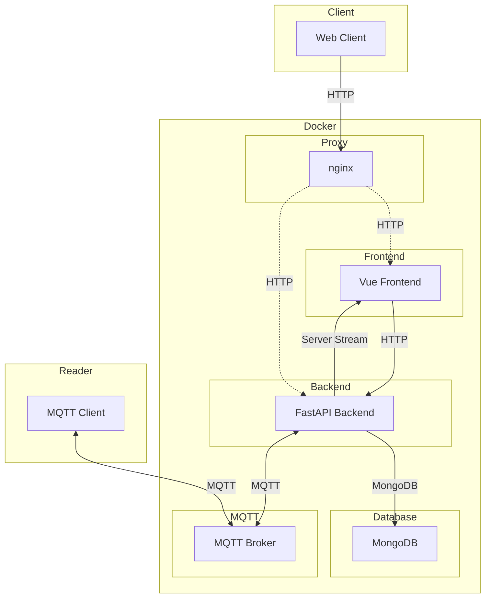
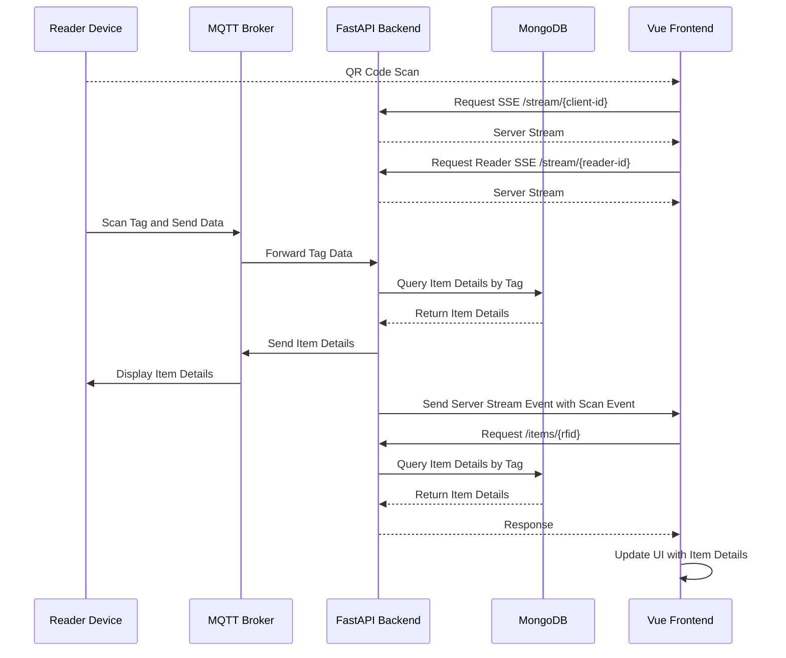

```  
                        _      _     _____ ____  _____   _  ____            
              _/||\_   / \  /|/ \ /|/  __//  __\/  __/  / \/ ___\   _/||\_  
              \    /   | |  ||| |_|||  \  |  \/||  \    | ||    \   \    /  
              /    \__ | |/\||| | |||  /_ |    /|  /_   | |\___ | __/    \  
               \||/ \/_\_/  \|\_/ \|\____\\_/\_\\____\  \_/\____/_\/ \||/   
                     |/                                         |/          
                  _  _     ___  _   ____  _____  _     _____ _____/\_       
            _/||\_\|/ \__/|\  \//  / ___\/__ __\/ \ /\/    //    /  \|_/||\_
            \    /  | |\/|| \  /   |    \  / \  | | |||  __\|  __\    \    /
            /    \  | |  || / /    \___ |  | |  | \_/|| |   | |       /    \
             \||/   \_/  \|/_/     \____/  \_/  \____/\_/   \_/        \||/ 

```

[](https://github.com/wims-org/wims/actions/workflows/docker-publish.yml) 
[](https://github.com/wims-org/wims/actions/workflows/playwright.yml)

# :package: WIMS :computer:

You might know your stuff, but do you know mine?

_**W**here **I**s **M**y **S**tuff_ (*German: Wo is' mein Scheiß?*) is a makerspace inventory tool designed for use by people who may not know what is available or where it is located.


*Pair a reader -> scan rfid tag -> browser opens item page*

> [!IMPORTANT] 
> Current State / Disclaimer:
> WIMS is currently in a **minimum viable product**-phase. This means it will lack a lot of quality of life features, presents a rudimentary design and might contain several bugs.
> 
> This project is quite young and depends on your input, please consider contributing! :heart:

## Components

Since this is a monorepo, so here is an overview:

* [Vue Frontend](vue_frontend)
The frontend is the accessed via mobile devices by scanning the displayed qr code on the reader or on a desktop
* [FastAPI Backend](backend)
The backend mainly acts as a link between the frontend, database and mqtt broker. It has minimal logic. 
* [Reader](hardware)
The 3D printed reader features a rfid reader and display and is a minimal frontend on its own. It sends scanned rfid tags to the broker to forward the client to the scanned item page. Powered by battery pack of a popular drill brand. 

## Setup
The provided `docker-compose.yml` includes all necessary startup configurations. Adapt it to your liking.

1. Start with `docker compose up`.
2. Visit [localhost:8080](localhost:8080) 

### Alternative: Helm Chart

See [Helm Chart](chart) for setup information.

### Adapting Service Configuration

There are several ways to configure the application. These are, ordered:

1. Default configuration, *which should be left as is and is overwritten by*
2. `config.yml`,  *which is overwritten by*
   
   + To make changes to the `config.yml`:

      1. Copy the backend configuration: `cp docker/config.dist.yml docker/config.yml`.
      2. Make changes to `config.yml`.
      3. Use `config.yml` in the backend service mount. 
3. Environment variables (ie. given in docker-compose.yml). These are dot-notated strings of their corresponding yml-paths, i.e.:
    ```yml
    server:
      host:
        port: 8080
    ```
    is overwritten by the env variable `server.host.port=1234`   


Visit the frontend and check the backend connection (default: [localhost:8080]).

## Development

To start developing, use the provided devcontainer. To start it, follow [the vscode documentation on dev containers](https://code.visualstudio.com/docs/devcontainers/containers).

Configure the backend service in `backend/src/config.yml`. Note the linked `config.dist.yml` file in the `/docker` folder.

Then start the backend and frontend services using the provided profiles in `.vscode/launch.json`:
+ `backend` and `frontend` for a native environment, or
+ `build-services` for full docker setup 


## Backup/Restore
For small database you can your the `/backup` endpoint of the API to quickly create json based backups of your database.

```bash
# Make a backup
curl http://wims/api/backup/create > /tmp/backup.json

# Restore a backup
curl -X POST  -F 'file=@/tmp/backup.json' -v http://wims/api/backup/load
```

The restore endpoint has a safe-guard and will only work on empty databases. So there is no way to accidentially
importing a backup and loosing files.

For bigger datbases, please directly use `mongodump` and `mongorestore` with the MongoDB database.

### Running Tests

To run full integration tests of all services together using playwright, you have multiple options:

1. Manual Native Services (Recommended atm):  
   + run `cd integration && npx playwright install --with-deps`
   + run the "backend" "frontend" and "integration-tests" launch command
1. Native (might be useful for debugging or bugged docker setups) (**WIP**):
   + run the "integration-tests" launch command *or*
   ```sh {interactive=true}
   docker compose -f docker-compose.yml -f integration/docker-compose.tests.yml up --build --force-recreate
   cd integration && npx playwright install --with-deps && npx playwright test`
    ```
    + *Note: currently, a playwright container is started with it, which is failing. Ignore or fix it* 
1. Container (**WIP**): 
   + the playwright container image executes all tests and prints out results.
    ```sh {interactive=true}
    docker compose -f docker-compose.yml -f integration/docker-compose.tests.yml up --abort-on-container-exit --exit-code-from playwright --build
    docker compose -f docker-compose.yml -f integration/docker-compose.tests.yml logs playwright
    ```
1. CI/CD (**WIP**): 
   + on push, tests are run automatically inside the playwright container
1. Native Services (**WIP**)
   + Add `integration/start-services.sh` as to the playwright config. Then run option 1.

When using the docker compose setup (all first three options), the volume of the database is reset each time the db container is restarted.

### Contribution

Pull requests are very much welcome! Also, consider opening an issue after looking into our open issues.

## Architecture



## Sequence Diagram



## License 

[GNU V3](COPYING)
