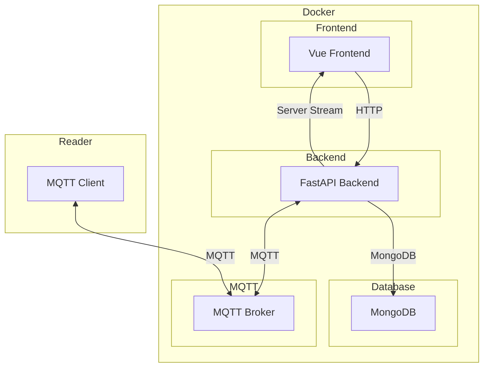
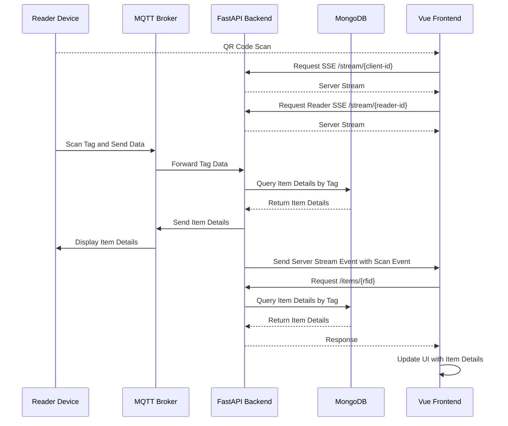

# Where Is My Stuff

You might know your stuff, but do you know mine?

_Where Is My Stuff_ is a makerspace-inventory-tool, meant to be used by a lot of people with no clue what is available and where.

## Architecture

## Sequence Diagram

## Set up
1. Copy backend config

    cp backend/src/config.dist.yml backend/src/config.yml

2. adapt `docker-compose.yml` `backend/src/config.yml` and `vue_frontend/.env.production` (for now) and start all containers with

    docker compose up -d

visit frontend, check backend connection ( default [172.19.128.1:5000] )

## Use Cases:

* Einlagern

* Finden

* Analyse

### Administrativ:

* Viele Dinge einlagern:

    Unter Zuhilfenahme von LLM (ChatGPT) vorausgefüllte Felder

    * Item
    Name, ID, Lagerort, Tags/Kategorie
        
        *Container TAG ID: uuid
        *Short Name: str
        Description
        *Amount	
        *Category/Tags
        Image[]
        Storage Location	
        Storage Location Tag ID	
        Current Location	
        borrowed by	
        Cost per Item
        Manufacturer	
        Model Number	
        UPC	ASIN	
        Serial Number	
        Vendor	
        Shop URL	
        Container Size
        Consumable bool
        Documentation

    * User

        ID
        Name
        Permissions?

* Dashboard
    
    show 0 Amount

* Attribute-Update Feature

### Daily Usage

* Access Frontend
    * prerequisites
        * for now Local WLAN
        * internet later
    * Access Frontend
        * Scan QR Code of generic Reader (session bound to reader, anonymous)
        * Scan QR Code of personal Reader (session bound to personal reader and specific user)

        * Scan NFC Tag
            * Generic Tag (just opens frontend)
            * Personal Tag (direct user login) (url+user_id)

* Login 
    * QR Code Photo
        * Username?

    * read Android Phone nfc tag  (too hard for now)

* Inventar durchsuchen 

* Finden & Nutzen / Item Auslagern (borrowed by)

* **Update Values**

    update item amount, price tag, location etc

* Delete/Archive

### Future Features:
* generate ebay 
* automatische ToDos
    * bestellen
    * aufräumen überfällig
* Sport / Decathlon Reader